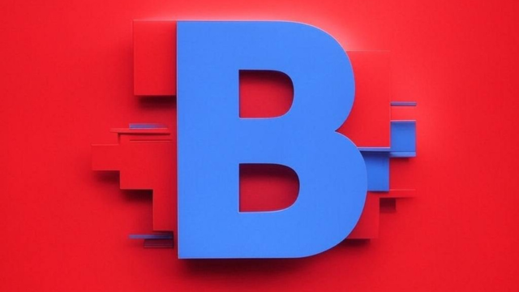

# @CanIBetOn monorepo

## Contents

- [app](./app), [components](./components), [lib](./lib), [stories](./stories) - source code for the frontend
- [app/api](./app/api) - source code for a small backend for gasless transactions
- [contracts](./contracts) - source code and scripts for the contracts
- [custom indexer](./graph) - Custom indexer setup to track pools and bets for the app

We have a separate repo for the agent code, which can be found on GitHub here in [can-i-bet-on/can-i-bet-on-agent](https://github.com/can-i-bet-on/can-i-bet-on-agent). There you will find our X and Telegram agents that create betting pools, and our custom oracle agent that grades the pools

## Production

The production app is hosted on Vercel at: <https://can-i-bet-on.vercel.app>

You can create a new betting pool on demand by [mentioning our agent, @CanIBetOn, on X here](https://x.com/CanIBetOn), or by [privately DMing our agent on Telegram here](https://t.me/HalluciBetrBot).

Our testnet contracts are deployed on Scroll Sepolia here:

- [0x2866B287F871F90A0494929877D575D1bA02d342](https://sepolia.scrollscan.com/address/0x2866b287f871f90a0494929877d575d1ba02d342)
- USDP - USD Points contract (Sepolia only). This is our ERC-20 token that lets users place bets on the app w/o financial risk, similar to Fliff Points in its current incarnation: [0xe4a063979014348Ae7D5811602Bebdd680ecf4e0](https://sepolia.scrollscan.com/address/0xe4a063979014348Ae7D5811602Bebdd680ecf4e0)

## Sponsors/Key tech

- [Scroll](https://www.scroll.io) - Our app has been [powered by Scroll Sepolia testnet](https://sepolia.scrollscan.com/address/0x2866b287f871f90a0494929877d575d1ba02d342) for the duration of the hackathon. Our subgraph is also indexing Scroll Sepolia. Scroll is a natural pick for this project since it supports solidity and has extremely low gas fees.
- [The Graph](https://thegraph.com) - We use The Graph to [index our bets and pools](https://github.com/can-i-bet-on-ethdenver2025/can-i-bet-on-monorepo/tree/main/graph) to display stats + use it for real time updating in the frontend w/ subgraph subscriptions. Our production app runs against [Subgraph Studio here](https://api.studio.thegraph.com/query/105510/promptbet/version/latest)
- [Privy](https://www.privy.io) - We use Privy's embedded wallet universally across the app and intend to use its funding onramp later to avoid having to go through so many menus to place bets w/ traditional web3 wallets. You can see the privy integration [in our automatic faucet/top up here](https://github.com/can-i-bet-on-ethdenver2025/can-i-bet-on-monorepo/blob/main/components/PrivyLoginButton.tsx#L54), how we use it to [sign in and sign up here](https://github.com/can-i-bet-on-ethdenver2025/can-i-bet-on-monorepo/blob/main/components/PrivyLoginButton.tsx#L10)
- [Alchemy](https://www.alchemy.com) - [Alchemy is our private RPC provider](https://github.com/can-i-bet-on-ethdenver2025/can-i-bet-on-monorepo/blob/main/app/api/signing/getSigningProps/route.ts#L15). Private RPCs were critical for managing gasless transactions, we built our backend around Alchemy
